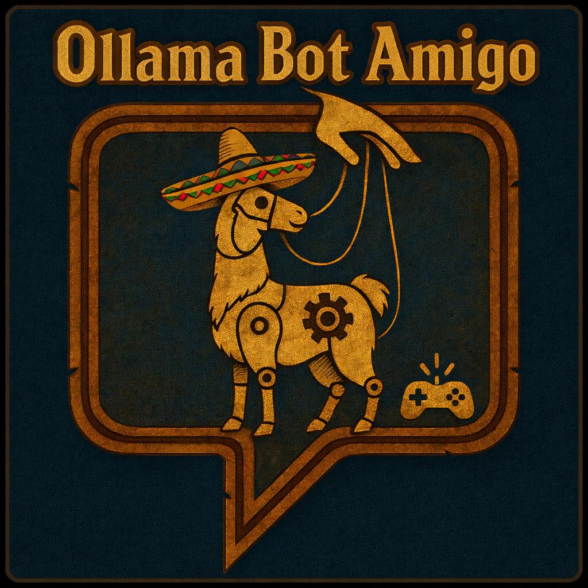

<p align="center">
  
</p>

# AzerothCore + Playerbots Module: mod-ollama-bot-amigo

> [!CAUTION]
> NOT FOR GENERAL USE YET -
> This module is very experimental at the moment and will not work, may break your server and will cause significant CPU load on your server due to LLM-driven bot automation. Use with caution.

## AzerothCore Catalogue (Required Metadata)

- **Name:** mod-ollama-bot-amigo
- **Description (GitHub repo description):** Experimental AzerothCore module that connects Playerbots to an Ollama LLM for bounded planning + control actions.
- **Author/Maintainer:** Orry (GitHub: `notOrrytrout`)
- **Original project/credit:** Forked from the Ollama Buddy bot work by Dustin Hendrickson (GitHub: `DustinHendrickson`) and contributors.
- **Installation:** See [Installation](#installation) below.
- **License:** GNU Affero General Public License v3.0 (`AGPL-3.0-only`) — see `LICENSE`.
- **GitHub Topic(s) for catalogue inclusion:** `azerothcore-module`

## Overview

***mod-ollama-bot-amigo*** is an experimental AzerothCore module (forked from Ollama Buddy bot) that connects Playerbots to an Ollama LLM for planning and a bounded set of control actions. The LLM picks a single tool call per tick; the module validates it and maps it to Playerbot commands. Combat tactics remain in PlayerbotAI, and the current focus is controlled movement, grind toggles, quest-giver interaction, and fishing.


## Features

- **Planner + control loop:** Optional long-term + short-term planner roles feed a control role that must emit exactly one tool call.
- **Strict tool-call enforcement:** Control responses must be exactly one `<tool_call>` block with validated arguments.
- **PlayerbotAI command bridge:** Tool calls map to Playerbot commands (move/grind/talk/turn); combat tactics remain inside PlayerbotAI.
- **Navigation + travel semantics:** The module builds nav candidates, validates reachability, and tracks move hop completion.
- **Quest and world snapshots:** Exposes active quests, quest givers in range, nearby entities, and local/world labels.
- **Item quest objectives:** Uses Playerbots loot data to find known creature and game-object sources, then emits only validated attack or gather actions for the required item.
- **Profession execution (fishing only):** `request_fish` and `request_profession` support fishing; other professions are rejected for now.
- **Persistent memory tables:** Optional planner/stuck/vendor tables in CharacterDatabase; currently used for cooldown/backoff and diagnostics (not injected into prompts yet).
- **Configurable models and logging:** Per-role models/prompts, tick timing, and debug logging toggles.

---

## Installation

> [!IMPORTANT]
> Dependencies are verified on macOS Monterey 12.7.6 and Ubuntu 22.04 LTS. Please open an issue with your OS and steps if you hit any compatibility issues.

1. **Prerequisites:**
   - A working AzerothCore (https://github.com/mod-playerbots/azerothcore-wotlk/tree/Playerbot) with the Player Bots module (https://github.com/mod-playerbots/mod-playerbots).
   - Requires:
     - cURL (https://curl.se/libcurl/)
     - fmtlib (https://github.com/fmtlib/fmt)
     - nlohmann/json (https://github.com/nlohmann/json)
     - Ollama LLM API server (https://ollama.com), running locally or accessible over your network.

2. **Clone the Module:**
   ```sh
   cd /path/to/azerothcore/modules
   git clone https://github.com/notOrrytrout/mod-ollama-bot-amigo.git
   ```

3. **Recompile AzerothCore:**
   ```sh
   cd /path/to/azerothcore
   cmake -S . -B build
   cmake --build build --parallel
   ```

4. **Configuration:**
   Copy the sample config and adjust as needed:
   ```sh
   cp /path/to/azerothcore/modules/mod-ollama-bot-amigo/conf/mod_ollama_bot_amigo.conf.dist /path/to/azerothcore/etc/modules/mod_ollama_bot_amigo.conf
   ```

5. **Restart the Server:**
   Start the `worldserver` binary from the AzerothCore build or install directory.

## Configuration Options

All configuration is in `mod_ollama_bot_amigo.conf`. Key settings:

- **Configuration precedence:**
  Environment variables (`AC_...`) override values in `mod_ollama_bot_amigo.conf`, which override built-in defaults.

- **OllamaBotControl.Enable:**
  Preferred toggle for the control loop (default: `1`).

- **OllamaBotControl.BotName:**
  Optional bot name filter (comma-separated list). Leave empty for all bots.

- **OllamaBotControl.Url:**
  Endpoint for Ollama API (`http://localhost:11434/api/generate` by default)

- **OllamaBotControl.Model.Planner / .PlannerLongTerm / .PlannerShortTerm / .Control:**
  Per-role LLM model identifiers (long/short fall back to Planner if unset).

- **OllamaBotControl.DelayMs.Control / .STG / .LTG / .Startup:**
  Control request cadence, short-term planner delay, long-term planner delay, and per-bot startup delay (all in ms).

- **OllamaBotControl.Planner.Enable / .Control.Enable:**
  Per-role enable flags for LLM requests.

- **OllamaBotControl.SystemPrompt.Planner / .ShortTerm / .Control:**
  Role-specific system prompts. Use `\n` to embed multi-line prompts inside the single-line config value.

- **OllamaBotControl.PromptFormat:**
  Control prompt formatting mode. `debug` uses verbose labels and pretty JSON. `compact` uses short labels and minified JSON.

- **OllamaBotControl.Nav.BaseDistance / .DistanceMultiplier / .MaxDistance / .DistanceBands:**
  Control navigation candidate distances. Base sets the initial hop size, multiplier scales each band, max caps distance, bands controls how many hop distances are offered.

- **OllamaBotControl.ClearGoalsOnConfigLoad:**
  When enabled, clears planner/control goals once after each config load.

- **OllamaBotControl.Planner.StateSummaryLog.Enable / .Path:**
  When enabled, appends planner `STATE_SUMMARY` blocks to the configured log file.

- **OllamaBotControl.EnablePlannerMemory / .EnableStuckMemory / .EnableVendorMemory:**
  Toggles for enabling planner/stuck/vendor memory storage tables.

- **OllamaBotControl.Llm.WorkerThreads / .MaxQueueDepth:**
  Sets the worker count and queue limit. Amigo applies reloaded settings after queued requests, active requests, and pending callbacks finish. Worker count changes take effect after a worldserver restart; the queue limit can change on reload.

- **OllamaBotControl.QuestingOnly / OllamaBotControl.Planner.ForcedLongTermGoal:**
  Helpers for running the bot as a dedicated questing bot. `QuestingOnly=1` injects a default questing long-term goal (unless `Planner.ForcedLongTermGoal` is set explicitly).

- **OllamaBotControl.Debug / OllamaBotControl.Planner.Debug / OllamaBotControl.Control.Debug:**
  Enable verbose logging for overall control, planner, and control loops.

Other options may be added as the project evolves.

## LLM Role Contracts

Each role is scoped to the minimum information it needs. This is enforced by how prompts are assembled in the module and how prompts are configured in `mod_ollama_bot_amigo.conf`.

**Planner (base context)**
- Receives: planner system prompt + state summary.
- Used as the base context for long-term planning prompts.

**PlannerLongTerm**
- Receives: long-term prompt + state summary.
- Must output exactly one sentence.

**PlannerShortTerm**
- Receives: short-term prompt + state summary + current long-term goal.
- Must output exactly one one-sentence goal.

**Control (executor)**
- Receives: control system prompt, current goal summary, control-focused state snapshot, and tool list/format.
- Must output exactly one `<tool_call>` block.

Role-specific system prompts are configured via:
- `OllamaBotControl.SystemPrompt.Planner` (also used for long-term planning)
- `OllamaBotControl.SystemPrompt.ShortTerm`
- `OllamaBotControl.SystemPrompt.Control`

## Control Tool Calls

Control returns one tool call selected from `decision_options`, or empty output when no new action is required.
Empty output preserves the active owner. Mock `auto` never emits an idle tool call.
Taxi and hearthstone are unavailable until they have retained destination completion checks.
The following table is generated from `src/Ai/ControlAction.cpp`.

<!-- control-catalog:start -->
| Tool | Completion |
| --- | --- |
| `request_idle()` | the waiting state remains unchanged |
| `request_move_hop(nav_epoch, candidate_id)` | the candidate reaches its arrival radius |
| `request_move_hop_npc(entry_id)` | the NPC is in interaction range |
| `request_enter_grind()` | Playerbots enters grind strategy |
| `request_attack_target(entry_id)` | the target is acted on or objective progress changes |
| `request_gather_target(entry_id)` | the object is added to Playerbots loot handling |
| `request_use_quest_object(entry_id)` | the quest objective count increases |
| `request_stop_grind()` | grind mode is cleared |
| `request_stay()` | the stay strategy is active |
| `request_unstay()` | the stay strategy is cleared |
| `request_talk_to_quest_giver(quest_id)` | the quest is rewarded or accepted |
| `request_fish()` | the fishing cycle succeeds or times out |
| `request_profession(skill, intent)` | the supported profession cycle completes |
| `request_turn_left_90()` | orientation changes |
| `request_turn_right_90()` | orientation changes |
| `request_turn_around()` | orientation changes |
| `request_repair()` | durability reaches 100 percent |
| `request_vendor_sell()` | requested gray-item count reaches zero |
| `request_vendor_buy_useful()` | food, drink, or ammunition count increases |
| `request_trainer()` | an eligible spell is learned or no eligible spell remains |
<!-- control-catalog:end -->

Notes:
- `request_move_hop` must echo `STATE_JSON.nav.nav_epoch` and choose a `candidate_id` from `STATE_JSON.nav.candidates` (only choose candidates where `can_move` is true, and preferably where `reachable` is true).
- `request_stop_grind` should be used when `STATE_JSON.bot.grind_mode` is true but you need to travel/quest/talk (it maps to Playerbot `follow`, and is allowed even if the bot is currently moving).
- `request_talk_to_quest_giver` must use a quest id from a `STATE_JSON.quest_givers_in_range` entry (`available_quest_ids` or `turn_in_quest_ids`).
- `request_use_quest_object` is offered only for an incomplete quest objective that requires using a nearby game object.
- `request_profession` currently supports `skill="fishing"` and `intent="fish"` only.

Examples:

`request_idle`
<tool_call>
{"name":"request_idle","arguments":{}}
</tool_call>

`request_move_hop`
<tool_call>
{"name":"request_move_hop","arguments":{"nav_epoch":42,"candidate_id":"nav_0"}}
</tool_call>

`request_profession`
<tool_call>
{"name":"request_profession","arguments":{"skill":"fishing","intent":"fish"}}
</tool_call>

## How It Works

1. **Bot Selection:**
   Only bots with a configured name (e.g., "Ollamatest") will be LLM-controlled. `OllamaBotControl.BotName` supports comma-separated names; leave it empty to target all bots.

2. **State Snapshot:**
   The module summarizes the bot's state, quests, nearby entities, and navigation candidates.

3. **Planner (Optional):**
   If enabled, the planner generates one long-term goal and one short-term goal at a time. Long-term and short-term planner models can be configured separately.

4. **LLM Control Decision:**
   The control LLM receives the current goals plus a control-focused snapshot and responds with a single tool call.

5. **Command Parsing & Execution:**
   The tool call is validated and mapped to Playerbot commands or internal executors (move hop, grind toggle, talk, turn, fish). Combat tactics remain inside PlayerbotAI.

## Debugging

Enable verbose logging in your worldserver for detailed insight into LLM requests, responses, and parsed control commands.

## Local LLM Stub for Manual Testing

If you want to drive the planner/action loops without running a real Ollama model, you can use the local stub at `src/Tools/ollama_stub.py`. It exposes an Ollama-compatible `/api/generate` endpoint and lets you enqueue tool calls with keyboard input.

1. **Point the module at the stub** (update your live config):
   - `OllamaBotControl.Url = http://127.0.0.1:11435/api/generate`

2. **Run the stub**:
   - `python3 src/Tools/ollama_stub.py`

3. **Use the console UI**:
   - `action <name> [json_args]` queues a tool call (use one of the supported tools).
   - `action request_profession {"skill":"fishing","intent":"fish"}` or `action request_fish {}` can be used for fishing tests.
   - `move <idx|candidate_id|forward|backward|left|right>` enqueues `request_move_hop` with `nav_epoch` + `candidate_id`.
   - `epoch <n>` sets the stub's `nav_epoch` used for move hops.
   - `idle`, `stay`, `unstay`, `grind`, `talk [quest_id]` enqueue other control tools.
   - `long <text>` and `short` enqueue planner outputs.
   - `nav <idx>` and `quest <id>` update convenience knobs.

The stub emits tool calls using the exact `<tool_call>{\"name\":...,\"arguments\":...}</tool_call>` format expected by the module, and it returns intent JSON goals that match the parser constraints in the codebase.

## Troubleshooting

- If your bots do not respond, check that their names match the control string in the loop.
- If you see missing `OllamaBotControl.SystemPrompt.*` warnings, add those keys to `mod_ollama_bot_amigo.conf` (the defaults are included in the `.conf.dist` file). Single-line prompts are accepted if you prefer not to embed newlines in the config.
- If you see missing model or memory-related warnings, copy the missing keys from `mod_ollama_bot_amigo.conf.dist` into your live config.
- If you see an HTTP 404, confirm that `OllamaBotControl.Llm.Provider` and `OllamaBotControl.Url` match the configured provider. Ollama uses `/api/generate`; oMLX uses `/v1/chat/completions`.
- Ensure the selected LLM provider is running and reachable from your server.
- Check your build includes all dependencies (curl, fmt, nlohmann/json).

## License

This module is released under the GNU Affero General Public License v3.0 (`AGPL-3.0-only`). See [LICENSE](LICENSE).

## Thanks

Thanks to Ollama Buddy Bot for their code.
  - Developed by Dustin Hendrickson.

Also brought to you in part by codex and ollama.

## Ollama and oMLX providers

Amigo can use either the native Ollama generate API or oMLX's OpenAI-compatible chat API. The gameplay/planner/chat layers use the same bounded dispatcher for both providers.

Ollama:

```ini
OllamaBotControl.Llm.Provider = ollama
OllamaBotControl.Url = http://localhost:11434/api/generate
```

oMLX:

```ini
OllamaBotControl.Llm.Provider = omlx
OllamaBotControl.Url = http://localhost:8000/v1/chat/completions
# Optional for a protected remote endpoint:
OllamaBotControl.Llm.ApiKey =
```

For oMLX, model names must match a model visible to the oMLX OpenAI-compatible API. Planner/control think policy is mapped to oMLX `enable_thinking`; if the selected model/template rejects it, Amigo retries without thinking and suppresses it for the session.


### Group authority

By default, Amigo treats party members (including the party leader) as peers rather than owners.
`OllamaBotControl.Group.Authority = peer` prevents Playerbots from silently promoting a real group member to permanent master/follow authority. Explicit party messages such as `follow me` or `assist me` create a temporary, time-bounded directive controlled by Amigo. `OllamaBotControl.Group.DirectiveTtlMs` controls its duration. Set authority to `playerbots` only to restore legacy Playerbots master behavior.


## Runtime mock inspection / injection

For deterministic control tests, the latest exact control snapshot can be inspected without guessing IDs:

```text
amigo state
```

This prints the compact `STATE_JSON` most recently supplied to the control model.

A mock tool can then be injected at runtime without editing/reloading the config:

```text
amigo mock request_attack_target entry_id=705
```

Other examples:

```text
amigo mock request_turn_left_90 {}
amigo mock request_gather_target entry_id=1731
amigo mock request_move_hop nav_epoch=7,candidate_id=nav_0
```

The injected tool call still passes through the normal parser, snapshot validation, mission/lifecycle gating, controller, and Playerbots execution.

Clear the runtime override with:

```text
amigo mock clear
```


## Independent mock roles

Mocking can be enabled independently for gameplay control, planning, and social/chat requests.
The legacy `OllamaBotControl.Llm.Mock.Enable` value is only the default inherited by a role when its role-specific key is omitted.

```ini
# Example: deterministic gameplay, real oMLX conversation
OllamaBotControl.Llm.Mock.Enable = 0
OllamaBotControl.Llm.Mock.Control.Enable = 1
OllamaBotControl.Llm.Mock.Planner.Enable = 1
OllamaBotControl.Llm.Mock.Chat.Enable = 0
```

When chat is enabled, `Mock.Chat.Enable = 0` sends direct social replies and event chatter through the configured real LLM provider. `Mock.Control.Enable = 1` keeps action selection on the deterministic mock path.

The control and planner mocks run inside Amigo. They do not require a separate mock server. This keeps gameplay decisions deterministic while chat can continue to use the configured real provider. The optional `src/Tools/ollama_stub.py` process remains available for testing the HTTP client path and is not required for normal runtime mock use.


## Quest item source behavior

For an active quest item objective, Amigo checks Playerbots' server-side loot data before it selects a target. It can route to a nearby creature that can drop the item or to a nearby game object that provides it. The controller checks the same objective state before it executes the attack or gather action. For a separate quest objective that requires activating a game object, Amigo approaches the object and uses it only while that objective remains incomplete.

If no valid source is known or the bot already has enough of the item, Amigo does not invent a kill target. It waits for another valid control action or for the normal Playerbots systems to make progress.
